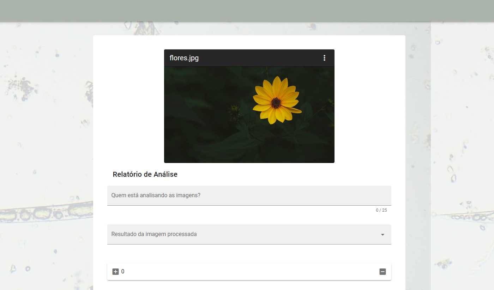
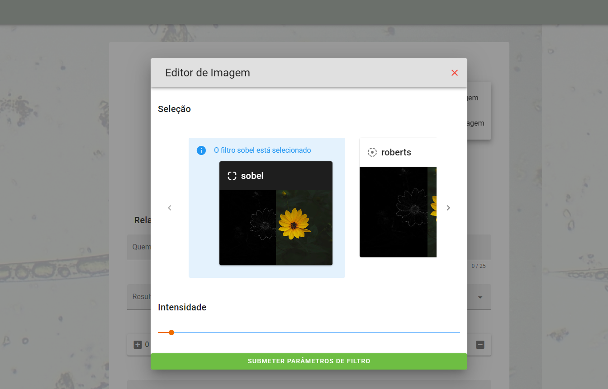

# nematoide-filtros-api

## Projeto edição filtros nematoide
Interface que ajuda o usuário a aplicar filtros na imagens afim facilitar a visualização 
de amostras por parte do técnico para analise de nematoides.

OBS: Como trabalhar com imagens em memória:
https://cloudbytes.dev/snippets/received-return-a-file-from-in-memory-buffer-using-fastapi

## Instalação
### Backend

#### 1. Instalar dependências de projeto
```pip install -r requirements.txt```

#### 2. Executar o projeto dentro da pasta Backend
```uvicorn views:app```


### Frontend

#### 3. Instalar dependência para servir o app
```npm install -g serve```

#### 4. Executar o projeto Frontend
```serve -s dist```

## Amostra Frontend
</img>
</img>

## Amostra Backend
</img>
